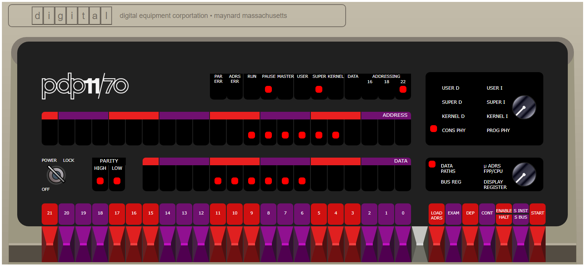

# PDP 11 Emulator in Javascript



This repository contains code to emulate either a 
[PDP 11/45](https://paulnank.github.io/pdp11-js/pdp11-45.html) or a
[PDP 11/70](https://paulnank.github.io/pdp11-js/pdp11.html) mini computer by Digital Equipment Corporation (DEC).

The emulator can be accessed at either [PDP 11/45](https://paulnank.github.io/pdp11-js/pdp11-45.html) or
[PDP 11/70](https://paulnank.github.io/pdp11-js/pdp11.html).

The emulator enables PDP 11 operating systems to be run directly in a browser with no additional configuration or setup.


## PDP 11/70 Emulator

This emulator came about because years ago I was a programmer for RSTS/E on a 
[PDP 11/45](https://paulnank.github.io/pdp11-js/pdp11-45.html) and had admired the console idle loop light pattern - but I couldn't quite remember how it looked. Given the unavailability of real systems it became time to write an emulator!

I was going to start with a 
[PDP 11/45](https://paulnank.github.io/pdp11-js/pdp11-45.html) emulator but the extra memory of a 
[PDP 11/70](https://paulnank.github.io/pdp11-js/pdp11.html) became far too attractive (a whole 4MB!). It took some time before I finally produced a
[PDP 11/45](https://paulnank.github.io/pdp11-js/pdp11-45.html) version.

I met my core objective - I can now see the RSTS/E console light pattern that I was looking for, and found that newer versions (eg v9.6) have a different light pattern. Also I have now seen some of the light patterns for other OSes. RSX and BSD 2.11 have their own different patterns and Unix V5 and Ultrix operate with absolute minimum light movement (I'm assuming they operate mostly in WAIT mode).

Getting all of the operating systems used here presents its own set of challenges - one of which is finding the software in the first place. But one of the most interesting was RSTS/E V06C which has its own [story](https://paulnank.github.io/pdp11-js/RSTSv06c.html).

Note: The [boot code](https://github.com/paulnank/pdp11-js/blob/master/macro-asm/boot.lst)
in this emulator is a custom PDP 11 program running with it's own set of light patterns. It is initially loaded at address 120000 and has a LIGHTS command which operates by mapping and executing a WAIT instruction from a pattern of virtual addresses. You can also use the BOOT command to start one of the guest operating systems, or the ODT command to start a version of the Octal Debugging Tool.

If you enjoy watching the light patterns for a working system then doing a make of BSD Unix provides a fairly good display. Boot from rp1, login to root, start make, and then watch the lights. Changing the console switch to physical display (PROG PHY) will show all 22 address bits being used:
```
Boot> b rp1
70Boot from xp(0,1,0) at 0176700
Press <CR> to boot, or any other key to abort: 0
: xp(0,1,0)unix
Boot: bootdev=05010 bootcsr=0176700

2.11 BSD UNIX (vixen.2bsd.com) (console)

login: root
erase, kill ^U, intr ^C
# cd /sys/VIXEN
# make
make -f Make.sys I=/usr/include H=../h M=../machine AS="/bin/as -V" CPP="/lib/cpp -P -DKERNEL -DVIXEN -DFPSIM -DSOFUB_MAP -I. -I../h"  CFLAGS="-O -DKERNEL -DVIXEN -DFPSIM -DSOFUB_MAP -I. -I../h" SED="/bin/sed"
cc -O -DKERNEL -DVIXEN -DFPSIM -DSOFUB_MAP -I. -I../h -S ../sys/init_main.c
/bin/sed -f SPLFIX init_main.s | /bin/as -V -u -o init_main.o
rm -f init_main.s
cc -O -DKERNEL -DVIXEN -DFPSIM -DSOFUB_MAP -I. -I../h -S ../sys/init_sysent.c
```

If you wish to toggle in a simple light chaser to the front panel then here are some switch commands which can be used:

```
Address Data    Code        Switch commands
                            HALT, 001000, LOAD ADDRESS
001000  012700  mov #1,r0   012700, DEPOSIT
001002  000001              000001, DEPOSIT
001004  006100  rol r0      006100, DEPOSIT
001006  000005  reset       000005, DEPOSIT
001010  000775  br .-4      000775, DEPOSIT
                            001000, LOAD ADDRESS, ENABLE, START
```
Note: Toggling switches to enter even a very simple program such as this is very tedious and prone to error. It generally pays to make a second pass through the memory locations to validate their content before starting the program. However this is what it was actually like to bootstrap early computers before the advent of a user friendly BIOS.

To restart the initial boot code (if it has not been overwritten) use the switch commands:

```
    	HALT, 120000, LOAD ADDRESS, ENABLE, START
```
The javascript code and sources for the bootstrap loader are available online in 
[github pages](https://github.com/paulnank/pdp11-js)

Happy emulating!

Paul Nankervis
