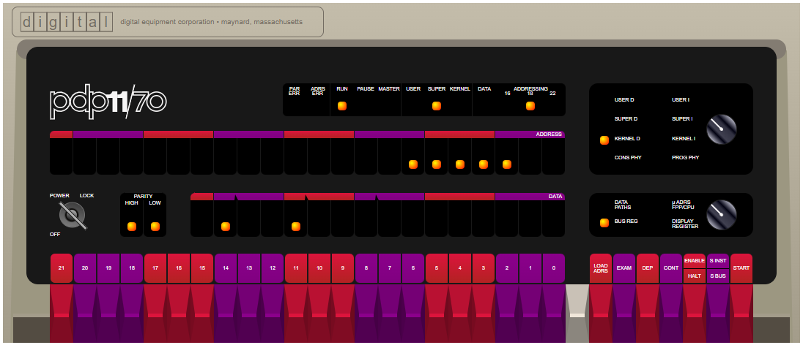

# PDP 11 Emulators in Javascript by Paul Nankervis



This repository contains the code originally written by Paul Nankervis to emulate several PDP 11 series microcomputers by Digital Equipment Corporation (DEC).

The code in this repository originally lived (and continues to live until further notice) at this address: [https://skn.noip.me/pdp11/pdp11.html](https://skn.noip.me/pdp11/pdp11.html)

Permission was given, by Paul to upload his source code to GitHub. This is the result of that work.


## Disk Images

The disk images containing a number of different PDP 11 operating systems can be found at:  [https://skn.noip.me/pdp11/pdp11.html](https://skn.noip.me/pdp11/pdp11.html)  These can be downloaded or run live in the emulator at that site.


## PDP 11/70 Emulator v2.0

This emulator came about because years ago I was a programmer for RSTS/E on a PDP 11/45 and had admired the console idle loop light pattern - but I couldn't quite remember how it looked. Given the unavailability of real systems it became time to write an emulator!

I was going to start with a PDP 11/45 emulator but the extra memory of a PDP 11/70 became far too attractive (a whole 4MB!). It took some time before I finally produced a [PDP 11/45](http://skn.noip.me/pdp11/pdp11-45.html) version.

I have met my core objective - I can now see the RSTS/E console light pattern that I was looking for, and found that newer versions (eg v9.6) have a different light pattern. Also I have now seen some of the light patterns for other OSes. RSX and BSD 2.11 have their own different patterns and Unix V5 and Ultrix operate with absolute minimum light movement (I'm assuming they operates mostly in WAIT mode).

Getting all of the operating systems used here presents its own set of challenges - one of which is finding the software in the first place. But one of the most interesting was RSTS/E V06C which has its own [story](https://skn.noip.me/pdp11/RSTSv06c.html).

Note: The boot code in this emulator is a custom PDP 11 program running with it's own set of light patterns. It is initially loaded at address 140000 and has a LIGHTS command which operates by mapping and executing a WAIT instruction from a pattern of virtual addresses located in Supervisor mode. You can also use the BOOT command to start one of the guest operating systems listed below, or the ODT command to start a version of the Octal Debugging Tool.

If you wish to toggle in a simple light chaser to the front panel then here are some switch commands which can be used:

```
Address Data    Code        Switch commands
                            HALT, 001000, LOAD ADDRESS
001000  012700  mov #1,r0   012700, DEPOSIT
001002  000001              000001, DEPOSIT
001004  006100  rol r0      006100, DEPOSIT
001006  000005  reset       000005, DEPOSIT
001010  000775  br .-4      000775, DEPOSIT
                            001000, LOAD ADDRESS, ENABLE, START
```
Note: Toggling switches to enter even a very simple program such as this is very tedious and prone to error. It generally pays to make a second pass through the memory locations to validate their content before starting the program. However this is what it was actually like to bootstrap early computers before the advent of a user friendly BIOS.

To restart the initial boot code (if it has not been overwritten) use the switch commands:

```
    	HALT, 140000, LOAD ADDRESS, ENABLE, START
```

If you plan to run the emulator repeatedly or for a project, consider downloading the emulator to your own machine or server. This will significantly speed any of the emulator disk accesses and response times. All files and emulator OS disks can be found in the top level folder of http://skn.noip.me/pdp11/ or in the single zip file http://skn.noip.me/pdp11/pdp11.zip

## Other Emulators

There are many PDP emulators out there and I have never seen what I consider to be a complete list. Some of the really interesting ones can be found by googling terms such as "vhdl pdp 11". However the gold standard seems to be SIMH at [Trailing Edge](http://simh.trailing-edge.com/). A different approach to Javascript PDP 11 emulation can be found at [www.pcjs.org](http://www.pcjs.org/devices/pdp11/).

I believe that the first PDP 11 emulator would be SIM-11 written in FORTRAN before the first PDP 11/20 hardware was even built - see [How the PDP-11 Was Born](http://www.hampage.hu/pdp-11/birth.html). There is more PDP 11 history at [www.hampage.hu](http://www.hampage.hu/pdp-11/main.html).

Of course if you want your own PDP 11/70 front panel you might consider [one of these](https://hackaday.io/project/8069-pidp-11).

Happy emulating!

Paul Nankervis

### List of guest OS's:

*Note: Due to the size of some of these images, they are not included in this GitHub repository themselves. Instead, they can be found on the [Releases](https://github.com/JamesHagerman/nankervis-pdp11-js/releases) page of this repo, or on Paul's original site. If using the Releases version, extract the archive and place the `*.dsk` and `*.tap` files in the `os-images/` directory inside this repository.*

```
Disk	OS	Comment
RK0	Unix V5	Boot using: unix then login as root
RK1	RT11 v4.0	The lightest/fastest OS here
RK2	RSTS V06C-03	Boot and login as 1,2 with password SYSTEM or as 11,70 using PDP
RK3	XXDP	Diagnostic OS and utilities
RK4	RT-11 3B	Distribution for RT-11 Version 3B
RK5	RT-11 V5.4F	Distribution for RT-11 Version 5.4F
TM0	RSTS 4B-17	Boot ROLLIN from TM0 and restore DK0 with "DK:<MT:VIXEN/REW". Reboot from DK0 with "/BO:DK" and login as 1,2 with password SYSTEMor 11,70 using PDP Commands are case sensitive.
RL0	BSD 2.9	Boot using: rl(0,0)rlunix   CTRL/D to get to multiuser
RL1	RSX 11M v3.2	Login as 1,2 with password SYSTEM
RL2	RSTS/E v7.0	Option: <LF> Suboption: <LF> ... Login as 1,2 using SYSTEM or 11,70 using PDP
RL3	XXDP	Larger version of diagnostics - including PDP 11/70 utilities
RP0	ULTRIX-11 V3.1	CTRL/D to enter multiuser mode. Login as root with no password
RP1	BSD 2.11	Will autoboot and enter multiuser mode. Login as root with no password
RP2	RSTS/E v9.6	Answer boot questions and login as 1,2 (password SYSTEM) or 11,70 (no password)
RP3	RSX 11M v4.6	Starts logged in as 1,2 (password SYSTEM) - user accounts 200,1 (no password) or 11,70 (password PDP)
```

Note: Disks are shown in approximately order size. The [RK05](https://en.wikipedia.org/wiki/RK05) disks at the top are small and not too bad to use across a network. The [RP06](http://www.columbia.edu/cu/computinghistory/rp06.html) disks at the bottom can be rather slow.


### Example Boot logs from the various OS disk images

Originally, these example boot logs were in the `pdp11.html` file. They've been moved to another file in this repo named `ExampleBoots.md`, found [here](ExampleBoots.md).

The examples are seriously worth looking through!
